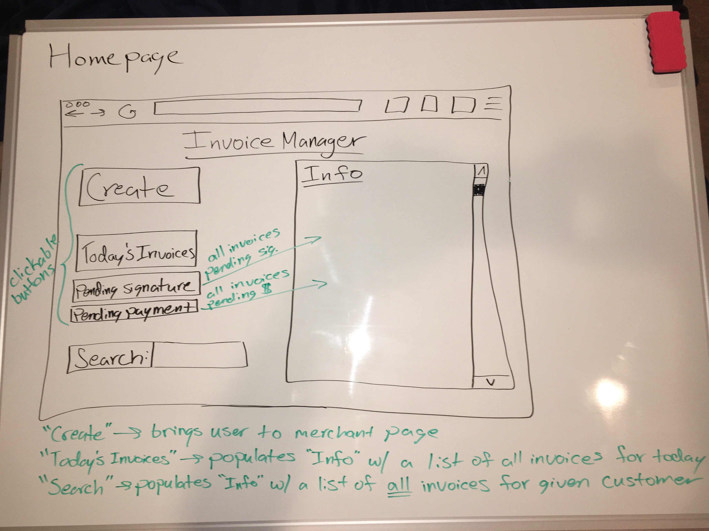

# Dream Design Web Application: Invoice Manager

## Application Description
> My dream web application is an invoice managing system that sends an invoice to the receving customer. The invoice will be accessible through the application where the recipient e-signs the document. Once the document is signed, the invoice is updated and marked as "payment pending". For this app to function, the merchant and all their customers will need PayPal and DocuSign accounts.

### Web Service(s) Used
> The invoicing portion of my application will be handled by the PayPal API. The PayPal Invoices API has numerous built in functions, which include drafting, sending, and updating of invoices. The merchant will need to make an API call to draft/generate the invoice—this request will include customer info, billing info, and a list of purchased items. Once the invoice is drafted, another API call is required to send the invoice. Support for the electronic signature will be provided by the DocuSign API. This API has a built in function that enables the web developer to embed a secure e-signature link in the web app. After the customer e-signs the invoice, the PayPal API makes another request to update the invoice on the merchant's end.

> Documentation:  
> https://developer.paypal.com/docs/api/invoicing/  
> https://www.docusign.com/developer-center/api-overview

## Top-Level Design/Layout
 

#### Homepage
> This is a mock up of the merchant's homepage of my web application. The "Info" element defaults to "Today's Invoices", also a button, upon start up. It will display a clickable list containing all of the merchant's invoices for the current day. Clicking on an invoice will change the "Info" element so that it displays the selected invoice and the status of the signature—pending or complete. "Pending Signature" and "Pending Payment" both function similar to the "Today's Invoices" button. The "Search" field is capable of autocomplete and only accepts customers' names. The image is annotated with a description of each component.

****

#### Create & Send
> This is a mock up of the web page for creating and sending a new invoice, only accessible by the merchant. The "Customer Name" text field autocompletes the entered name. Once the user clicks on a new text field or off the current one, the customer's billing and shipping information and email address are displayed in their respective elements. The "Date" text field is autofilled with the current date, but can be modified. The "Item" element is a text field that turns into a drop down menu when clicked. The merchant must manually type the quantity in pounds and price per pound in their appropriate elements. The plus sign and accompanying text are clickable, and a new item to the list. While the merchant inputs items the prices at the bottom of the page continuously update. The "Save & Send" button initiates the API calls based off of the entered information. The image is annotated with a description of each component.

****

#### Sign & Send
> This is a mock up of the customer's web page. This web page defaults by showing a clickable list of "Pending Invoices", also a button, in the "Invoice" element. "Past Invoices" also brings up a list, but the button can only be clicked once dates are enter into the two text fields. The element at the bottom left displays the merchant's contact information. The "Invoice" element in the image shows the interface after an invoice is selected from a list. Thus, the customer can check the invoice for accuracy, and quickly sign and return the image to the merchant—with one click. Clicking "Sign & Send" initiates the API calls. The image is annotated with a description of each component.

## Usage Scenarios

### Drafting and Sending an Invoice
> The creation of an invoice is only accessible by the merchant. They merchant will start at the homepage and click on "Create" to generate a new invoice. This will bring the merchant to a new page where they are prompted to enter info into text boxes. The merchant must first enter the customer's name into the given field; the text will autocomplete the name based off of the merchant's database of customers. Each cutomer's name is associated with an object that includes billing and shipping info and their email address. All of this information will autofill into the appropriate elements in the interface so that the merchant can check its accuracy. Next, the merchant has to type in the date, if there is a desire to change it, and each item the customer purchased. Upon being clicked, the "Item" field will turn into a drop down menu; however, it will still allow text entry. The merchant needs to enter the name, quantity, and price per unit for each item. The "Quantity" and "Price" fields only accept numbers—the standard quantity and price per unit is pounds and price per pound, respectively. If the merchant intends on entering more than three items they must click "Add Another Item" or the plus sign; another row will appear at the bottom of the list of items. As the merchant inputs quantities and prices, the "Price of Items" field will automatically update to display the cost of all the items, summing the products of quantity and price. The "Tax" field will also update automatically, multiplying the price of the items and the tax percentage. Similarly, the "Total" field will update as the user inputs items. The final step is clicking "Save & Send", which will make two API calls. The first API call will draft the invoice, taking all the info from the text fields and using it to send the request. This request will return a lot of data, but the only important piece is the ID of the invoice. Upon the succes of this API call, another API call will be made that requires two parameters: invoice_id and notify_merchant. The invoice_id is taken from the first API call and notify_merchant is always set to false so that the merchant does not receive an email notification. The second API call sends the invoice to the customer.

### E-Signing an Invoice
> Once the customer receives an invoice, it will be added to the list of invoices that are pending a signature. Upon clicking the "Pending Invoices" button, the "Invoice" element will be populated with a clickable list of all the invoices that still require a signature. Clicking on one of the invoices will change the "Invoice" element to show the selected invoice. Here, the customer can review the invoice. Signing and returning the invoice to the merchant only requires a single click of the "Sign & Send" button. This action will result in two API calls. First, the DocuSign API will send a request with the customer's unique ClientUserId and a status. This request will return an event parameter equal to signing_complete. Upon the succes of this API call, the PayPal API will update the invoice. This request also requires both invoice_id and notify_merchant parameters; however, notify_merchant will be set to true so that they receive a notification. The request will update merchant_memo, an element in the invoice object, so that it is equal to "Invoice Signed". This API call will mark the invoice as signed and move it out of the "Pending Invoices" list. However, if the customer notices the invoice is incorrect then they must contact the merchant so they can update it and send it back to the customer.

## Design Rationale
> State why your design is the way it is: relevant priorities, mental models, interaction design concepts, guidelines, principles, theories, etc. Cite relevant references as needed.

## Usability Metric Forecast
> If implemented, my web app would excell in learnability, efficiency, and satisfaction. Through my work experience at a wholesale seafood distributor, I learned the numerous inefficiencies that are associated with the current paper invoicing system they use. By using my dream web app, or something similar, they would be able to send drivers on there delivery routes faster because there is no need to wait for the invoices to be created an printed. Thus, converting to an electronic invoicing system would boost the business's efficiency. The interface itself is also very efficient. The buttons are clearly labeled and the interface continuously updates based on user input. The customers can sign and return an invoice with a total of two clicks. Because the interface is simple and free of clutter, learnability would be a strong metric. The user's inputs also give feedback, updating the page as they click elements or fill in text fields. 

## References
> Cite formally, as you would with any other research paper.
